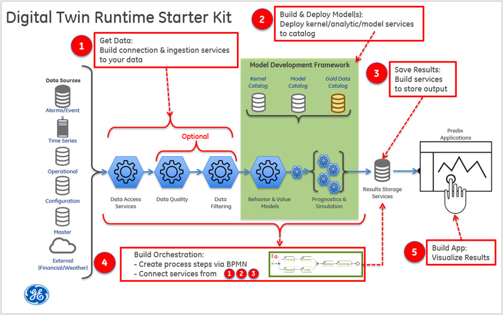

Build the Digital Twin Starter Kit: Introduction
-
**What you'll learn to do**

You will learn the definition and concepts of the Digital Twin as well as the considerations and methods for creating a Digital Twin.

**What you need to do**

**What is a Digital Twin?**

*A Digital Twin is a collection of behavioral models that continuously increase insights into an individual physical asset to deliver specific business value.*

A Digital Twin has five defining features:

1.  **Per asset:** The Digital Twin is applied to individual assets.  A Digital Twin instance models and tracks a single specific asset over its lifetime.  Most functional or mathematical formulas, called kernels, can be reused across assets belonging to the same asset class. At runtime each twin will need to be trained specifically for an individual asset to achieve asset level customization.

2.  **Generates value:**  The Digital Twin is used to create demonstrable business value; e.g., to have zero unplanned outages and an optimized output.

3.  **Adaptable:** The Digital Twin infrastructure and models can be applied to other part or asset classes, or adapt to new scenarios or new factors. 

4.  **Continuously updated:**  The Digital Twin models update continually as the physical asset is operated. At any moment the Digital Twin exhibits a faithful representation of the current state of the asset.  The output of the model changes with every airplane flight or with every fuel burn hour. 

5.  **Scalable:** Benefit is derived when hundreds or thousands of like assets have a Digital Twin.  A Digital Twin tracking a single asset learns from all of the other similar assets.

**The 5-step Starter Kit**

There are 5 steps to creating and deploying a Digital Twin:

**Step 1: Get Data**

Digital Twins need a vast amount of data to predict and understand an asset's specific condition, life, performance, and service constraints. Once an asset’s sensor data are available on disk, data services become the mechanisms that expose and provide this data to a consumer. They provide the connections to the various repositories where the needed information is stored, eliminating the need for individual models to have to handle direct repository connections, database querying, etc. 

The goal of Step 1 is to ensure that the data needed for a specific model is accessible. The challenge is to build reusable general purpose data services that can be leveraged by multiple models at scale, as well as to build a gold dataset that can be used to measure model effectiveness.

**Step 2: Build and Deploy Model(s)**

Step 2 focuses on the construction of kernels, models, analytics, etc. Kernels are the basic functional and mathematical formulas, while models are kernels that have been trained for a specific asset. Here, either new kernels are created or existing kernels reused, and then trained using the data services and gold data discussed in Step 1 to create a model representing an individual asset. Once these models have been verified against the gold data, they can be deployed to an operational or production environment.

**Step 3: Save Results**

After a model runs, the output of that run needs to be saved. Saving the output allows it to be utilized by any downstream processes, as well as making it available for understanding the behavior of the model over time. The results storage is the convergence point for parallel runs when many twins are being manually or continuously updated. 

In addition to saving the model output, the model state must also be saved. If a model is retraining itself and evolving to reflect incoming data, model state should be persisted so that future runs are always starting from the most recently modeled asset condition.

**Step 4: Build Orchestration**

As mentioned earlier, the implementation of a Digital Twin is a collection of various services and software components executed in a sequence to produce information utilized to drive business value. Constructing and executing this sequence is referred to as *orchestration.* They are created by combining the data services from Step 1 with the deployed models described in Step 2, executed in sequence, with results stored as described in Step 3. These orchestrations execute based on a trigger: potentially an event, timer, or external request, and run in both automated and semi-automated fashions.

**Step 5: Build Applications**

The Digital Twin is, by definition, a system of models/analytics that enables better insight into assets to provide valuable benefits to customers, industrial players, partners, system integrators, and horizontal industrials. However, the models themselves are not the only part of the story. Applications are necessary to tie together multiple Twins and communicate Twin outputs while also bringing in other data streams such as market pricing or service schedules to help define the value story and allow operators to provide valuable outcomes.

**Tutorial Scenario: A Sample Digital Twin Application**

Steam turbines have a rotating shaft component, called a rotor, that spins at different rates of speed depending on operating conditions. The rotor sits on a set of bearings that enable the rotor to spin in place with minimal friction, thereby assisting in the overall efficiency of the turbine. Over time, the weight of the rotor pressing on the bearings, plus the friction of the rotor spinning against the bearings, causes the bearings to wear, become out-of-round, and degrade to the point where they fail causing damage to the rotor. Replacing a damaged rotor in a turbine is an extremely costly event that should be avoided.

For our example Digital Twin scenario, we use a model that compares the actual rotor RPM and corresponding bearing temperature with the expected RPM and temperature that the physics and design constraints dictate. The model example provided utilizes coefficients to "tune" the model to the specific lifing characteristics of the specific steam turbine. This will allow us to detect whether or not the bearings are starting to degrade so that we can proactively repair the rotor before it fails.

### What you learned

You have learned the defining characteristics of a Digital Twin and the Five Steps that go into creating a Digital Twin.

Next: [Getting Started](Getting Started.md)

