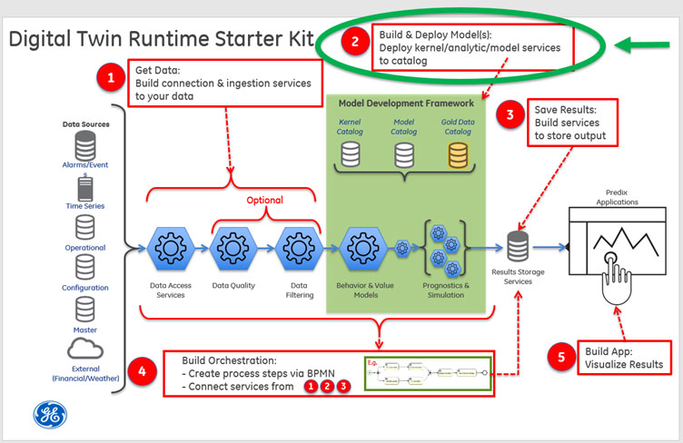
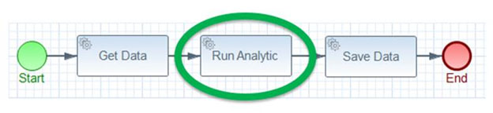
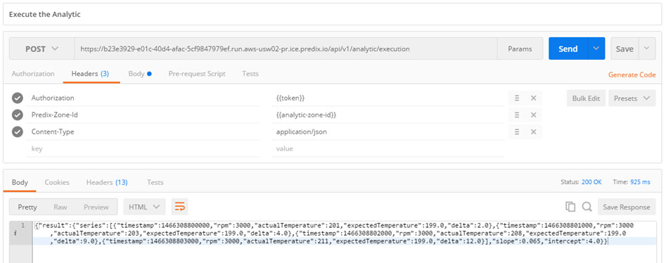

Previous: [Step 1](Step-1.md)

#**Step 2: Build and Deploy Models**

##**What you'll learn to do**

Step 2 focuses on how Digital Twin models and analytics are built, deployed, and run. Digital Twin models and analytics will be run via REST endpoints. In most cases, these models and analytics will be deployed to an instance of a[* Predix Analytic Catalog *](https://predix-io-dev.grc-apps.svc.ice.ge.com/services/service.html?id=1187)or an instance of a [*Predix Analytic Runtime*](https://predix-io-dev.grc-apps.svc.ice.ge.com/services/service.html?id=1174) and executed through a workflow orchestration (see [Step 4](Step-4.md)). The Predix Analytics Catalog allows uploading models that are developed in Python, Java, or Matlab. For more information, refer to the Predix documentation on [*Analytic Development Process*](https://predix-io-dev.grc-apps.svc.ice.ge.com/docs/#Qd2kPYb7).

The simple workflow:

In this part of the tutorial, you will:

-   Find the Predix-Zone-Id of the your Predix-Analytics-Catalog

-   Create the **tutorial-actual-vs-expected-analytic application**

-   Upload the analytic to the Analytic Catalog

-   Execute the analytic hosted in the Analytic Catalog

  

##**What you need to set up**

For this step, you will need an instance of the Analytics Catalog and an instance of the Predix UAA service. If you want to use the provided Postman collection to interact with the REST endpoints, you will need to set the authorization header with the bearer token for the UAA client that has permission to call the REST endpoint since the applications are secured. If you have not set up these services or secured the provided Postman collection, please see the [Getting Started](Getting Started.md) section for instructions. 

##**What you need to do**

###**Find the Predix-Zone-Id of the your Predix-Analytics-Catalog**

In this part of the tutorial, you’ll need to know what your Predix-Zone-Id is for your Predix-Analytics-Catalog instance.

From the command line using the Cloud Foundry command line interface (cf cli) you’ll run commands to find the guid, which is the Predix Zone ID, of your instance of the predix-analytic-catalog service. For example:

<pre>
D:\mydir\steam-turbine-tutorial\tutorial-svcs\tutorial-analytic&gt; cf services
Getting services in org DigitalTwin / space dev as 200000000@mail.ad.ge.com ...
OK
name                            service                             plan           bound apps           last operation
...
my-analytics-catalog              predix-analytics-catalog   Bronze      tutorial-asset         create succeeded
...
D:\mydir\steam-turbine-tutorial\tutorial-svcs\tutorial-analytic&gt; cf service my-analytics-catalog --guid
<strong>69ab882f-ab6d-4c5a-8a4d-68f3a0148b22</strong>
D:\mydir\steam-turbine-tutorial\tutorial-svcs\tutorial-analytic&gt;
</pre>

The guid string returned (for example, 69ab882f-ab6d-4c5a-8a4d-68f3a0148b22) is used as the value for the header parameter Predix-Zone-Id in Predix Analytic Catalog REST API calls. We’ll need this guid soon.

###**Create the tutorial-analytic**

If you've already created the tutorial-asset application as described in **Step 1**: "Create the tutorial-asset to application," then you already have the code locally.  

If you have not already built the code, you can do so with the following commands:

<pre>
$ cd steam-turbine-tutorial/tutorial-analytics/tutorial-actual-vs-expected-analytic
$ mvn clean package
</pre>

###**Upload the analytic to the Analytic Catalog**

You can interact with the Predix Analytic Catalog through its REST API by using the provided Postman collection.

For all of the REST API calls, you will need to set the “Predix-Zone-Id” http header variable with the predix-zone-id, also known as the service GUID value, of your Analytic Catalog service instance. Here are the relevant API calls

<table>
<thead>
<tr class="header">
<th><strong>Step, Postman Request, and Sample URL</strong></th>
<th><strong>Header Params Required</strong></th>
<th><strong>Sample Body for POST Requests</strong></th>
</tr>
</thead>
<tbody>
<tr class="odd">
<td>
1

POST Create catalog entry

https://predix-analytics-catalog-release.run.aws-usw02-pr.ice.predix.io/api/v1/catalog/analytics

The response body contains an “id”. This is the used as the catalogEntryId in the next step and as the &lt;analytic-id&gt; in steps 3 and 4. Note this analytic id as we’ll need it later when we want to execute the analytic.
</td>
<td><table>
<thead>
<tr class="header">
<th><strong>Parameter</strong></th>
<th><strong>Value</strong></th>
</tr>
</thead>
<tbody>
<tr class="odd">
<td>Authorization</td>
<td>Bearer Token</td>
</tr>
<tr class="even">
<td>Predix-Zone-id</td>
<td>Analytic Catalog guid</td>
</tr>
<tr class="odd">
<td>Content-type</td>
<td>application/json</td>
</tr>
</tbody>
</table></td>
<td>{ 
&quot;name&quot;:&quot;steam-turbine-actual-vs-expected-analytic&quot;, 
&quot;version&quot;:&quot;v1&quot;, 
&quot;supportedLanguage&quot;:&quot;Java&quot;, 
&quot;taxonomyLocation&quot;:&quot;&quot;, 
&quot;author&quot;:&quot;Jane Doe&quot;, 
&quot;description&quot;:&quot;This analytic computes deltas between the actual (timeseries data) and expected (model predicted) temperatures values.&quot;, 
&quot;customMetadata&quot;:&quot;&quot; 
}</td>
</tr>
<tr class="even">
<td>
2

 

POST Upload analytic file/jar

https://predix-analytics-catalog-release.run.aws-usw02-pr.ice.predix.io/api/v1/catalog/artifacts

The value of "type" should be "Executable"
</td>
<td><table>
<thead>
<tr class="header">
<th><strong>Parameter</strong></th>
<th><strong>Value</strong></th>
</tr>
</thead>
<tbody>
<tr class="odd">
<td>Authorization</td>
<td>Bearer Token</td>
</tr>
<tr class="even">
<td>Predix-Zone-id</td>
<td>Analytic Catalog guid</td>
</tr>
</tbody>
</table></td>
<td><table>
<thead>
<tr class="header">
<th><strong>Form Field Name</strong></th>
<th><strong>Type</strong></th>
<th><strong>Value</strong></th>
</tr>
</thead>
<tbody>
<tr class="odd">
<td>file</td>
<td>file</td>
<td>
 

Browse and select your file

 
</td>
</tr>
<tr class="even">
<td>catalogEntryId</td>
<td>string / text</td>
<td>id from the created analytic entry (see above response)</td>
</tr>
<tr class="odd">
<td>type</td>
<td>string / text</td>
<td>“executable”</td>
</tr>
<tr class="even">
<td>description.</td>
<td>string / text</td>
<td>describe the analytic</td>
</tr>
</tbody>
</table></td>
</tr>
<tr class="odd">
<td>
3

POST Validate your analytic

https://predix-analytics-catalog-release.run.aws-usw02-pr.ice.predix.io/api/v1/catalog/analytics/&lt;analytic-id&gt;/validation

The response body will contain a validationRequestId. This will be used in the next step as the &lt;validation-request-id&gt;. The analytic may take several minutes to validate. You can go ahead to the next step which will check the validation status of the analytic.
</td>
<td><table>
<thead>
<tr class="header">
<th><strong>Parameter</strong></th>
<th><strong>Value</strong></th>
</tr>
</thead>
<tbody>
<tr class="odd">
<td>Authorization</td>
<td>Bearer Token</td>
</tr>
<tr class="even">
<td>Predix-Zone-id</td>
<td>Analytic Catalog guid</td>
</tr>
<tr class="odd">
<td>Content-type</td>
<td>application/json</td>
</tr>
</tbody>
</table></td>
<td>{ 
&quot;series&quot;: [{ 
&quot;timestamp&quot;: 1466308800000, 
&quot;rpm&quot;: 3000, 
&quot;actualTemperature&quot;: 201 
}, { 
&quot;timestamp&quot;: 1466308801000, 
&quot;rpm&quot;: 3000, 
&quot;actualTemperature&quot;: 203 
}, { 
&quot;timestamp&quot;: 1466308802000, 
&quot;rpm&quot;: 3000, 
&quot;actualTemperature&quot;: 208 
}, { 
&quot;timestamp&quot;: 1466308803000, 
&quot;rpm&quot;: 3000, 
&quot;actualTemperature&quot;: 211 
}], 
&quot;slope&quot;: 0.065, 
&quot;intercept&quot;: 4.0 
}</td>
</tr>
<tr class="even">
<td>
4

GET Check the status of your analytic

https://predix-analytics-catalog-release.run.aws-usw02-pr.ice.predix.io/api/v1/catalog/analytics/&lt;analytic-id&gt;/deployment/&lt;validation-request-id&gt;

Note: The response body’s “status” field will change to “COMPLETED” when the validation has finished.
</td>
<td><table>
<thead>
<tr class="header">
<th><strong>Parameter</strong></th>
<th><strong>Value</strong></th>
</tr>
</thead>
<tbody>
<tr class="odd">
<td>Authorization</td>
<td>Bearer Token</td>
</tr>
<tr class="even">
<td>Predix-Zone-id</td>
<td>Analytic Catalog guid</td>
</tr>
</tbody>
</table></td>
<td></td>
</tr>
</tbody>
</table>

Note that Predix provides additional services for analytic support. These are the [Predix Analytics Runtime](https://www.predix.io/services/service.html?id=1174) and the [Predix Analytics User Interface](https://www.predix.io/services/service.html?id=1586). Predix has documented the [Analytic Development Process](https://www.predix.io/docs#Qd2kPYb7) which you can explore on your own.

###**Execute the analytic hosted in the Analytic Catalog**

For the tutorial analytic, the POST request body for the analytic execution needs a JSON object consisting of an array (rpmSeries) of JSON objects consisting of a time stamp (timestamp), revolutions per minute (rpm), and actual temperature (actualTemperature) values followed by the slope and intercept values (coefficients for the regression model). An example of this JSON data is in the table below.

To execute your analytic, you will need the id of the deployed analytic. There’s a GET endpoint on the API in the [Analytics Catalog](https://www.predix.io/services/service.html?id=1187#/) called “/api/v1/catalog/analytics”. You can use this to retrieve the analytic id. You used this analytic id when you deployed your analytic via the REST API to the Analytic Catalog in the previous step.

You will also need a bearer token for your tutorial-svcs client and the Predix-Zone-Id for your Predix Analytics Catalog service. Both of which you should already have from completing earlier sections.

Now you can make the following POST request to the Analytic Catalog to execute your analytic:

<table>
<thead>
<tr class="header">
<th><strong>Postman Request, and Sample URL</strong></th>
<th><strong>Header Params Required</strong></th>
<th><strong>Sample Body for POST Requests</strong></th>
</tr>
</thead>
<tbody>
<tr class="odd">
<td>
POST Execute the analytic

https://&lt;analytic-id&gt;.run.aws-usw02-pr.ice.predix.io/api/v1/analytic/execution
</td>
<td><table>
<thead>
<tr class="header">
<th><strong>Parameter</strong></th>
<th><strong>Value</strong></th>
</tr>
</thead>
<tbody>
<tr class="odd">
<td>Authorization</td>
<td>Bearer Token</td>
</tr>
<tr class="even">
<td>Predix-Zone-id</td>
<td>Analytic Catalog guid</td>
</tr>
<tr class="odd">
<td>Content-type</td>
<td>application/json</td>
</tr>
</tbody>
</table></td>
<td>{ 
&quot;series&quot;: [{ 
&quot;timestamp&quot;: 1466308800000, 
&quot;rpm&quot;: 3000, 
&quot;actualTemperature&quot;: 201 
}, { 
&quot;timestamp&quot;: 1466308801000, 
&quot;rpm&quot;: 3000, 
&quot;actualTemperature&quot;: 203 
}, { 
&quot;timestamp&quot;: 1466308802000, 
&quot;rpm&quot;: 3000, 
&quot;actualTemperature&quot;: 208 
}, { 
&quot;timestamp&quot;: 1466308803000, 
&quot;rpm&quot;: 3000, 
&quot;actualTemperature&quot;: 211 
}], 
&quot;slope&quot;: 0.065, 
&quot;intercept&quot;: 4.0 
}</td>
</tr>
</tbody>
</table>

In **Step 4**, the BPMN file needs to know the above execution URL to run your analytic in the Digital Twin workflow. 

##**What you learned**

You learned how to find the predix zone id of your predix analytics catalog for use in the HTTP headers. You also learned how use the Predix Analytic Catalog to upload, validate, check the status of, and execute the pre-built analytic by using the catalog’s REST API.

Next: [Step 3](Step-3.md)
