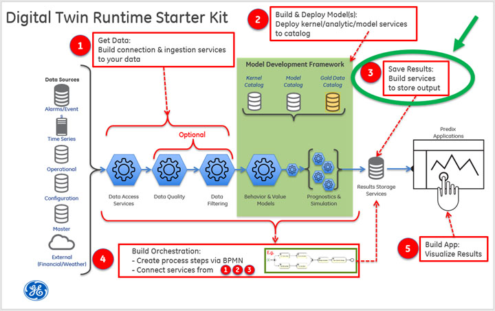

Previous: [Step 2](Step-2.md)

#**Step 3: Save Results**

##**What you'll learn to do**

Step 3 illustrates how to build and deploy a "save data" service that exposes REST endpoints (URLs).

The simple workflow:

 In this part of the tutorial, you will:

-   Create the **tutorial-result-persistence** application

-   Create the **tutorial-analytic-post-processing** application

##**What you need to set up**

Prior to deploying these tutorial service applications to the cloud, you'll need a [UAA service](https://www.predix.io/services/service.html?id=1172) instance, a [PostgreSQL service](https://www.predix.io/services/service.html?id=1178) instance, and a [Message Queue service](https://www.predix.io/services/service.html?id=1182) instance (RabbitMQ). If you want to use the provided Postman collection to interact with the REST endpoints, you will need to set the authorization header with the bearer token for the UAA client that has permission to call the REST endpoint since the applications are secured. If you have not set up these services or secured the provided Postman collection, please see the **Getting Started** section for instructions. 

**Note**: In order to save the output from the analytic, it needs to be transformed into a JSON structure that can be handled by the "save-data" (tutorial-result-persistence) service. We have created another service (tutorial-result-post-processing) that takes in the JSON output from the analytic and returns a transformed JSON structure that can easily be POSTed to the "save-data" service.

##**What you need to do**

###**Create the tutorial-result-persistence application**

The tutorial-result-persistence application exposes REST endpoints that allow for saving, modifying, retrieving, and deleting analytic results. Refer to **Getting Started** for download and maven build instructions. In this step of the tutorial, we’ll be using the “save” feature of this tutorial-result-persistence service. In Step 5 of the tutorial, we’ll use this service again to retrieve some analytic results for visualization purposes.

**Note: **There is a hardcoded substring in the StompProperties.java file in the \\tutorial-svcs\\tutorial-result-persistence\\src\\main\\java\\com\\ge\\digitaltwin\\tutorial\\result directory. The substring is a part of the argument to the @ConfigurationProperties annotation on this class. It is expecting the name of the RabbitMQ service instance to be “tutorial-rabbitmq”. If your RabbitMQ instance is named differently, then you’ll need to change the value in this annotation in the StompProperties.java file.

<table>
  <tr>
    <th>Replace this…</th><th>…with this</th>
  </tr>
  <tr>
    <td>"vcap.services.tutorial-rabbitmq.credentials.protocols.stomp"</td>
    <td>"vcap.services.&lt;your-rabbitMQ-service-name&gt;.credentials.protocols.stomp"</td>
  </tr>
</table>

And then rebuild the jar file with this command:

<pre>mvn clean package</pre>

This RabbitMQ service is used to publish events when data is persisted so that in Step 5 the user interface can refresh its display.

1)  Configure the appropriate section of the "manifest.yml" file in the tutorial-svcs directory to reflect your environment.

<pre>
- name: &lt;YOUR_OWN_UNIQUE_PREFIX&gt;-tutorial-result-persistence
  host: &lt;YOUR_OWN_RESULT_SERVICE_PREFIX&gt;-dt-tutorial-result-persistence
  memory: 1G
  services:
  - &lt;YOUR_POSTGRES_SERVICE_FOR_RESULT_DATA&gt;
  - &lt;YOUR_RABBITMQ_SERVICE&gt;
  path: tutorial-result-persistence/target/tutorial-result-persistence-1.1-SNAPSHOT.jar
  env:
    security_oauth2_resource_tokenInfoUri: https://&lt;YOUR_UAA_INSTANCE_HERE&gt;.predix-uaa.run.aws-usw02-pr.ice.predix.io/check_token
    security_oauth2_client_clientId: &lt;YOUR_CLIENT_ID&gt;
</pre>

Notes:

-   The application **name** must be unique across your CloudFoundry organization.

-   The **host** must be unique across Predix as this becomes the URL for the microservice. If you receive an error message while pushing your service to the cloud in the next step, define a new **host**.

-   In the **services** list, substitute your postgres service instance name for &lt;YOUR\_POSTGRES\_SERVICE\_FOR\_RESULT\_DATA&gt;.

-   In the **services** list, substitute your rabbitmq service instance name for &lt;YOUR\_RABBITMQ\_SERVICE&gt;. This should be “tutorial-rabbitmq” unless you modified the StompProperties.java file.

-   Substitute your UAA instance name for &lt;YOUR\_UAA\_INSTANCE\_HERE&gt;.

-   Substitute your client id for &lt;YOUR\_CLIENT\_ID&gt;.

2)  Push it to Cloud Foundry

<pre>C:\steam-turbine-tutorial\tutorial-svcs&gt; cf push &lt;YOUR_OWN_UNIQUE_PREFIX&gt;-tutorial-result-persistence --no-start</pre>

3)  You'll need to set an environment variable for the security\_oauth2\_client\_clientSecret. You could set this in the manifest.yml file instead, but we recommend using an environment variable as it is more secure than storing passwords in a file, which may result in them being accidentally committed to your source code repository.

<pre>C:\steam-turbine-tutorial\tutorial-svcs&gt; cf set-env &lt;YOUR_OWN_UNIQUE_PREFIX&gt;-tutorial-result-persistence security_oauth2_client_clientSecret &lt;your Client Id's secret&gt;</pre>

4)  Start your application.

<pre>C:\steam-turbine-tutorial\tutorial-svcs&gt; cf start &lt;YOUR_OWN_UNIQUE_PREFIX&gt;-tutorial-result-persistence</pre>

5)  Use "cf apps" to discover the URL to your service. Prepend the “https://” protocol then append your API path to get the full URL to your data service

<pre>
C:\steam-turbine-tutorial\tutorial-svcs\tutorial-result-persistence&gt; cf apps
Getting apps in org DigitalTwin / space dev as 200000000@mail.ad.ge.com...
OK
name                                       requested state   instances   memory   disk   urls
...
tutorial-result-persistence         started                1/1             1G           1G     <strong>dt-tutorial-result-persistence.run.aws-usw02-pr.ice.predix.io</strong>
...
</pre>

6)  Test the service with Postman

-   Try the “Post a single result” REST endpoint.

-   Try the “Get all analytic results” REST endpoint and check if the result you posted is in the list.

###**Create the tutorial-analytic-post-processing service**

This application takes the JSON output from the analytic and transforms it into a different JSON structure that can easily be saved via a POST to the tutorial-result-persistence service. Refer to **Getting Started** for download and maven build instructions.

1)  Configure the appropriate section of the "manifest.yml" file in the tutorial-svcs directory to reflect your environment.

<pre>
- name: &lt;YOUR_OWN_UNIQUE_PREFIX&gt;-tutorial-analytic-post-processing
  host: &lt;YOUR_OWN_POSTPROCESSING_PREFIX&gt;-dt-tutorial-analytic-post-processing
  memory: 1G
  path: tutorial-analytic-post-processing/target/tutorial-analytic-post-processing-1.1-SNAPSHOT.jar
  env:
    security_oauth2_resource_tokenInfoUri: https://&lt;YOUR_UAA_INSTANCE_HERE&gt;.predix-uaa.run.aws-usw02-pr.ice.predix.io/check_token
    security_oauth2_client_clientId: &lt;YOUR_CLIENT_ID&gt;
</pre>

Notes:

-   The application **name** must be unique across your CloudFoundry organization.

-   The **host** must be unique across Predix as this becomes the URL for the microservice. If you receive an error message while pushing your service to the cloud in the next step, define a new **host**.

-   Substitute your UAA instance name for &lt;YOUR\_UAA\_INSTANCE\_HERE&gt;.

-   Substitute your client id for &lt;YOUR\_CLIENT\_ID&gt;.

2)  Push it to Cloud Foundry

<pre>C:\steam-turbine-tutorial\tutorial-svcs&gt; cf push &lt;YOUR_OWN_UNIQUE_PREFIX&gt;-tutorial-analytic-post-processing --no-start</pre>

3)  You'll need to set an environment variable for the security\_oauth2\_client\_clientSecret. You could set this in the manifest.yml file instead, but we recommend using an environment variable as it is more secure than storing passwords in a file, which may result in them being accidentally committed to your source code repository.

<pre>C:\steam-turbine-tutorial\tutorial-svcs&gt; cf set-env &lt;YOUR_OWN_UNIQUE_PREFIX&gt;-tutorial-analytic-post-processing security_oauth2_client_clientSecret &lt;your Client Id's secret&gt;</pre>

4)  Start your application

<pre>C:\steam-turbine-tutorial\tutorial-svcs&gt; cf start &lt;YOUR_OWN_UNIQUE_PREFIX&gt;-tutorial-analytic-post-processing</pre>

5)  Use "cf apps" to discover the URL to your service. Prepend the “https://” protocol then append your API path to get the full URL to your data service

<pre>
C:\steam-turbine-tutorial\tutorial-svcs\tutorial-analytic-post-processing&gt; cf apps
Getting apps in org DigitalTwin / space dev as 200000000@mail.ad.ge.com...
OK
name                                                   requested state   instances   memory   disk   urls
...
tutorial-analytic-post-processing          started                  1/1            1G           1G     <strong>dt-tutorial-analytic-post-processing.run.aws-usw02-pr.ice.predix.io</strong>
...
</pre>

6)  Get a bearer token and test your service with Postman.

-   Try the “Transform analytic output” POST request. Note the assetId value on the URL and the body contains the results from executing the analytic.

##**What you learned**

You have learned how to set up the services needed to transform and save the results of the analytic to a postgres database. These services publish the following endpoints (with sample invocation URLs):

As a review and reference, these are the rest endpoints exposed by the "tutorial-result-persistence" (an implementation of a typical "save data" service) and “tutorial-result-post-processing” services:

<table>
<thead>
<tr class="header">
<th><strong>REST Service</strong></th>
<th><strong>URL Example</strong></th>
<th><strong>Description</strong></th>
</tr>
</thead>
<tbody>
<tr class="odd">
<td>POST convert raw analytic result to format to save</td>
<td>
https://dt-tutorial-analytic-post-processing.run.aws-usw02-pr.ice.predix.io/transform/&lt;assetId&gt;

Request body should look like this (analytic output):

<pre>{
  &quot;result&quot;: {
    &quot;series&quot;: [
      {
        &quot;timestamp&quot;: 1467747958000,
        &quot;rpm&quot;: 3000,
        &quot;actualTemperature&quot;: 201,
        &quot;expectedTemperature&quot;: 199,
        &quot;delta&quot;: 2
      },
      {
        &quot;timestamp&quot;: 1467748018000,
        &quot;rpm&quot;: 3000,
        &quot;actualTemperature&quot;: 204,
        &quot;expectedTemperature&quot;: 199,
        &quot;delta&quot;: 5
      }
    ],
    &quot;slope&quot;: 0.065,
    &quot;intercept&quot;: 4
  }
}
</pre>

 
</td>
<td>
Use this service to transform the analytic- generated results to the desired persistence format.

 
</td>
</tr>
<tr class="even">
<td>POST (save) analytic results from a JSON request payload</td>
<td>
https://dt-tutorial-result-persistence.run.aws-usw02-pr.ice.predix.io/persistence/analyticResults

Request body should look like:

<pre>
{
 &quot;expectedTemperature&quot;: 199.0,
 &quot;actualTemperature&quot;: 201.0,
 &quot;timestamp&quot;: 1466308800000,
 &quot;assetId&quot;: &quot;1&quot;,
 &quot;temperatureDelta&quot;: 2.0
}
</pre>

 
</td>
<td>Use this service to save the analytic results to query later.</td>
</tr>
<tr class="odd">
<td>POST (save) list of analytic results from a JSON request payload</td>
<td>
https://dt-tutorial-result-persistence.run.aws-usw02-pr.ice.predix.io/api/analyticResults

Request body should look like:

<pre>
[
  {
    &quot;expectedTemperature&quot;: 199.0,
    &quot;actualTemperature&quot;: 201.0,
    &quot;timestamp&quot;: 1466308800000,
    &quot;assetId&quot;: &quot;1&quot;,
    &quot;temperatureDelta&quot;: 2.0
  },
  {
    &quot;expectedTemperature&quot;: 199.0,
    &quot;actualTemperature&quot;: 204.0,
    &quot;timestamp&quot;: 1466308860000,
    &quot;assetId&quot;: &quot;1&quot;,
    &quot;temperatureDelta&quot;: 5.0
  }
]
</pre>

 
</td>
<td>
Use this service to save a list of analytic results to query later.

 

Note: This assumes that your payloads are relatively small. If you have larger payloads, you will need to modify this.

 
</td>
</tr>
<tr class="even">
<td>DELETE single analytic result</td>
<td>https://dt-tutorial-result-persistence.run.aws-usw02-pr.ice.predix.io/persistence/analyticResults/&lt;Analytic Result Id&gt;</td>
<td>Use this service to delete a single analytic result from the database</td>
</tr>
<tr class="odd">
<td>DELETE all analytic results</td>
<td>
https://dt-tutorial-result-persistence.run.aws-usw02-pr.ice.predix.io/admin/analyticResults

Note: you must have admin credentials to do this
</td>
<td>Use this service to delete all of the saved analytic results</td>
</tr>
<tr class="even">
<td>GET (read) analytic results</td>
<td>https://dt-tutorial-result-persistence.run.aws-usw02-pr.ice.predix.io/persistence/analyticResults</td>
<td>Use this service in a visualization web application (or other service) to retrieve the results from the Digital Twin analytic.</td>
</tr>
</tbody>
</table>

We will continue with the orchestration of our services in **Step 4**.

Next: [Step 4](Step-4.md)
