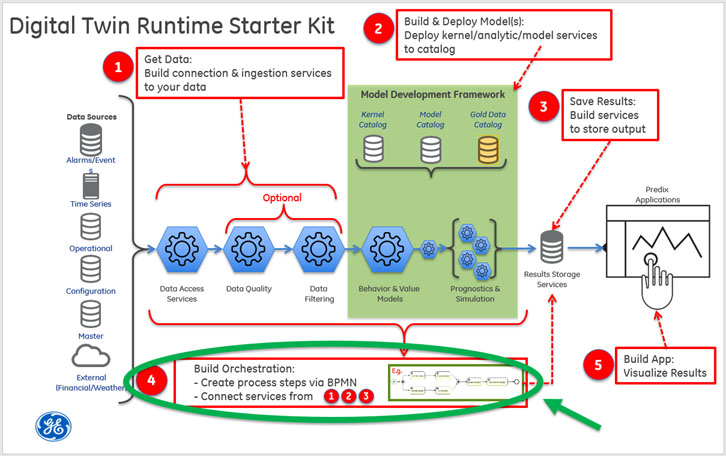
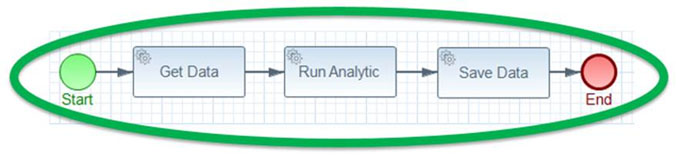
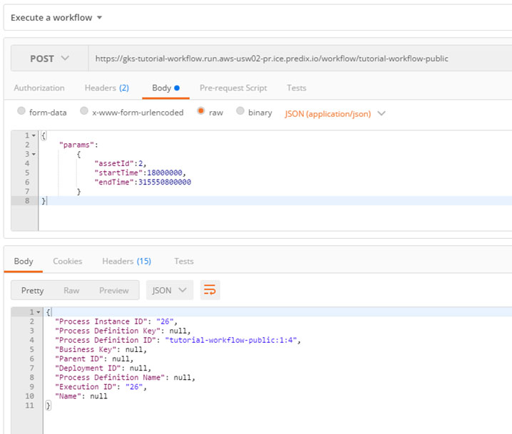
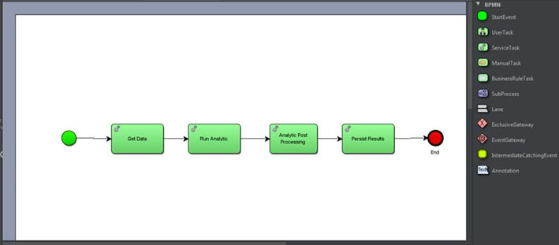

**Step 4: Build Orchestration**

**What you'll learn to do**

Step 4 illustrates how to build and deploy a "workflow" orchestration service that is accessible via a REST endpoint (URL). 

The simple workflow:

In this part of the tutorial, you will:

-   Create the **tutorial-workflow** service application

    -   Configure a BPMN (Business Process Model and Notation) file

-   Create the **tutorial-simulator** service application

**What you need to set up**

Prior to creating this orchestration service, you’ll need to have completed **Step 1**, **Step 2**, and **Step 3** of this tutorial. You should also be familiar with [*BPMN* ](http://www.activiti.org/userguide/index.html#bpmnConstructs)and *Alfresco Activiti BPMN Designer.* If you want to use the provided Postman collection to interact with the REST endpoint, you will need to set the authorization header with the bearer token for the UAA client that has permission to call the REST endpoint since the application is secured. If you have not set up these services or secured the provided Postman collection, please see the **Getting Started** section for instructions. Having the [*Alfresco Activiti BPMN Designer*](http://docs.alfresco.com/4.1/tasks/wf-install-activiti-designer.html) plug-in for Eclipse or the [*actiBPM*](https://plugins.jetbrains.com/plugin/7429) plug-in for IntelliJ will help with the editing of the BPMN file.

As we saw in **Step 2: Build and Deploy Models**, a Twin model is responsible for acting upon a set of input data about the twin asset and then producing some output of value representative of the physical twin's condition.  This Orchestration Service is used to execute a Digital Twin model by defining the sequence of tasks to acquire input data, run the analytic/model, and persist the twin analytic/model output.  The orchestration service also handles the passing of data from step to step.

**What you need to do**

**Create the workflow service**

The tutorial-workflow application exposes a REST endpoint '/workflow/{workflow-id}' that executes the named workflow (we’ll discuss {workflow-id} momentarily) thereby orchestrating the services that we built in previous steps. Refer to **Getting Started** for download instructions. We will need to update the BPMN file to reference the REST endpoints that we deployed in Steps 1, 2, and 3 before building and deploying this service. Refer to **Getting Started** for download and maven build instructions.

Note that the services that this workflow orchestrates have minimal error checking in place. In your own implementations of similar services, it is worth investing the time to generate meaningful error messages to accompany any exceptions that might be thrown.

**Update BPMN file**

-   Open the tutorial-svcs/tutorial-workflow/src/main/resources/processes/tutorialWorkflow.bpmn file in a text editor.

-   Find the &lt;process&gt; tag and note the value of its “id” attribute. This is the aforementioned {workflow-id} and is “tutorial-workflow-public” in the context of this tutorial.

-   For the Run Analytic task, update the predixZoneId field value with the guid value of your Predix Analytic Catalog service.

-   Update the url for each service task to match its purpose. You can see the sample URL from the Postman collection. Primarily you are updating the Predix GUIDs that are part of the URL.

<table>
<thead>
<tr class="header">
<th>DT Step</th>
<th>BPMN Task</th>
<th> Postman Request</th>
<th>Sample URL </th>
</tr>
</thead>
<tbody>
<tr class="odd">
<td>1</td>
<td>GetData</td>
<td>GET Get analytic input data</td>
<td>https://dt-tutorial-data.run.aws-usw02-pr.ice.predix.io/input?assetId={assetId}&amp;startTimestamp={startTime}&amp;endTimestamp={endTime}]]</td>
</tr>
<tr class="even">
<td>2</td>
<td>
 

RunAnalytic 
 

 
</td>
<td>
 

POST Execute the analytic
</td>
<td>https://302b3d05-671e-47b3-bb38-b51c98d4e7e2.run.aws-usw02-pr.ice.predix.io/api/v1/analytic/execution/]]</td>
</tr>
<tr class="odd">
<td>4</td>
<td>AnalyticPostProcessing</td>
<td>POST Transform analytic output</td>
<td>https://dt-tutorial-result-persistence.run.aws-usw02-pr.ice.predix.io/api/analyticResults]]</td>
</tr>
<tr class="even">
<td>3</td>
<td>
 

PersistResults

 
</td>
<td>POST Post list of results</td>
<td>https://302b3d05-671e-47b3-bb38-b51c98d4e7e2.run.aws-usw02-pr.ice.predix.io/api/v1/analytic/execution/]]</td>
</tr>
</tbody>
</table>

-   Save your changes to the BPMN file and then build your tutorial-workflow service.

**Note**: When creating your own workflow, refer to the appendix at the end of this tutorial step for an explanation of the Digital Twin Orchestration Java Delegates, details about BPMN file, and helpful delegate classes.

1.  Configure the appropriate section of the "manifest.yml" file in the tutorial-svcs directory to reflect your environment.

<table>
<thead>
<tr class="header">
<th>- name: &lt;YOUR_OWN_UNIQUE_PREFIX&gt;-tutorial-workflow 
host: &lt;YOUR_OWN_WORKFLOW_SERVICE_PREFIX&gt;-dt-tutorial-workflow 
memory: 1G 
path: tutorial-workflow/target/tutorial-workflow-1.1-SNAPSHOT.jar 
env: 
security_oauth2_resource_tokenInfoUri: https://&lt;YOUR_UAA_INSTANCE_HERE&gt;.predix-uaa.run.aws-usw02-pr.ice.predix.io/check_token 
security_oauth2_client_clientId: &lt;YOUR_CLIENT_ID&gt;</th>
</tr>
</thead>
<tbody>
</tbody>
</table>

-   The application **name** must be unique across your CloudFoundry Org.

-   The **host** must be unique across Predix as this becomes the URL for the microservice. If you receive an error message while pushing your service to the cloud in the next step, define a new **host**.

-   Substitute your UAA instance name for &lt;YOUR\_UAA\_INSTANCE\_HERE&gt;.

-   Substitute your client id for &lt;YOUR\_CLIENT\_ID&gt;.

1.  Push it to Cloud Foundry

| C:\\steam-turbine-tutorial\\tutorial-svcs&gt; cf push &lt;YOUR\_OWN\_UNIQUE\_PREFIX&gt;-tutorial-workflow --no-start |
|----------------------------------------------------------------------------------------------------------------------|

1.  You'll need to set an environment variable for the security\_oauth2\_client\_clientSecret. You could set this in the manifest.yml file instead, but we recommend using an environment variable as it is more secure than storing passwords in a file, which may result in them being accidentally committed to your source code repository.

| C:\\steam-turbine-tutorial\\tutorial-svcs&gt; cf set-env &lt;YOUR\_OWN\_UNIQUE\_PREFIX&gt;-tutorial-workflow security\_oauth2\_client\_clientSecret &lt;your Client Id's secret&gt; |
|-------------------------------------------------------------------------------------------------------------------------------------------------------------------------------------|

1.  Start your application.

| C:\\steam-turbine-tutorial\\tutorial-svcs&gt; cf start &lt;YOUR\_OWN\_UNIQUE\_PREFIX&gt;-tutorial-workflow |
|------------------------------------------------------------------------------------------------------------|

1.  Use "cf apps" to discover the URL to your service. Prepend the “https://” protocol then append your API path, /workflow/{workflow-id}, to get the full URL to your data service.

<table>
<thead>
<tr class="header">
<th>
C:\steam-turbine-tutorial\tutorial-svcs&gt; cf apps

Getting apps in org DigitalTwin / space dev as 200000000@mail.ad.ge.com... 
OK 
name                                   requested state   instances   memory   disk   urls 
... 
tutorial-workflow                   started                 1/1              1G          1G     <strong>dt-tutorial-workflow.run.aws-usw02-pr.ice.predix.io</strong> 
...
</th>
</tr>
</thead>
<tbody>
</tbody>
</table>

Get a bearer token and test your service with Postman.

-   Try the “Execute a workflow” POST request: The body of the request should have a “params” key which defines an object that contains keys and values for “assetId”, “startTime” and “endTime”.

-   The sample payload below asks the workflow to run against assetId 2 (&lt;steam-turbine-id&gt; from Step 1) between 18000000 (1 January 1970) and 315550800000 (1 January 1980). This date range encompasses the test data which was pushed to the timeseries service at the end of Step 1. Note that you must ensure that model coefficients exist and data exists for the selected assetId in the chosen startTime-endTime date range.

<table>
<thead>
<tr class="header">
<th>Sample JSON body for POST workflow execution</th>
</tr>
</thead>
<tbody>
<tr class="odd">
<td>{ 
&quot;params&quot;: 
{ 
&quot;assetId&quot;:2, 
&quot;startTime&quot;:18000000, 
&quot;endTime&quot;:315550800000 
} 
}</td>
</tr>
</tbody>
</table>

These are the rest endpoints of interest to the "tutorial-workflow" (an implementation of a typical "workflow" service):

| **REST Service**        | **URL Example**                                                                               | **Description**                                                       |
|-------------------------|-----------------------------------------------------------------------------------------------|-----------------------------------------------------------------------|
| POST - run the workflow | https://dt-tutorial-workflow.run.aws-usw02-pr.ice.predix.io/workflow/&lt;workflow-id&gt;      
                                                                                                                          
                           https://dt-tutorial-workflow.run.aws-usw02-pr.ice.predix.io/workflow/tutorial-workflow-public  
                                                                                                                          
                           Include Authorization with appropriate Bearer token in headers.                                | Sample request body (template parameters used in bpmn file):          
                                                                                                                                                                                                  
                                                                                                                            {"params":{"assetId":2,"startTime":18000000,"endTime":315550800000\]  |

If your workflow executed successfully, then the results of the analytic must have been saved via the service application that you created in Step 3 (tutorial-result-persistence). That service application has an endpoint that allows you to get a list of all the analytic results. You can use the “Get all analytic results” request from the Postman collection’s “Step 3 – Store Data” folder to verify that your workflow properly executed.

**Create the tutorial simulator service application**

This service simulates new data coming into your workflow by invoking the workflow on different time windows of the data that already exists in your timeseries database. Note that this simulator does not actually create any new data. It relies on data that you pushed to timeseries back in Step 1. The simulator also generates Swagger documentation for all RESTful endpoints for running the simulator. The Swagger GUI may be accessed via web browser at /swagger-ui.html.

1.  Configure the appropriate section of the manifest.yml file in the tutorial-svcs directory to reflect your environment.

<table>
<thead>
<tr class="header">
<th>- name: &lt;YOUR_OWN_UNIQUE_PREFIX&gt;-tutorial-simulator 
host: &lt;YOUR_OWN_SIMULATOR_PREFIX&gt;-dt-tutorial-simulator 
memory: 1G 
path: tutorial-simulator/target/tutorial-simulator-1.1-SNAPSHOT.jar 
env: 
# If using a proxy configure your proxy settings 
# JAVA_OPTS: -Dhttps.proxyHost=&lt;HOST&gt; -Dhttps.proxyPort=&lt;PORT&gt; -Dhttp.nonProxyHosts=localhost 
tutorial_simulator_oauth2_accessTokenUri: https://&lt;YOUR_UAA_INSTANCE_HERE&gt;.predix-uaa.run.aws-usw02-pr.ice.predix.io/oauth/token 
tutorial_simulator_oauth2_clientId: &lt;YOUR_CLIENT_ID&gt; 
security_oauth2_resource_tokenInfoUri: https://&lt;YOUR_UAA_INSTANCE_HERE&gt;.predix-uaa.run.aws-usw02-pr.ice.predix.io/check_token 
security_oauth2_client_clientId: &lt;YOUR_CLIENT_ID&gt; 
tutorial_workflow_workflowUri: https://&lt;YOUR_OWN_WORKFLOW_SERVICE_PREFIX&gt;-dt-tutorial-workflow.run.aws-usw02-pr.ice.predix.io/workflow/tutorial-workflow-public 
tutorial_workflow_workflowMethod: post 
tutorial_workflow_workflowBodyTag: params 
spring_application_json: | 
{ 
&quot;tutorial&quot; : { 
&quot;workflow&quot; : { 
&quot;workflowHeaders&quot; : [ 
{ 
&quot;name&quot; : &quot;Predix-Zone-Id&quot;, 
&quot;value&quot; : “&lt;YOUR_ANALYTIC_CATALOG_ZONE_ID_HERE&gt;” 
}, 
{ &quot;name&quot; : &quot;Content-type&quot;, 
&quot;value&quot; : &quot;application/json&quot; 
} 
] 
} 
} 
}</th>
</tr>
</thead>
<tbody>
</tbody>
</table>

-   The application **name** must be unique across your CloudFoundry Org.

-   The **host** must be unique across Predix as this becomes the URL for the
    microservice. If you receive an error message while pushing your service to the cloud in the next step, define a new **host**.

-   Substitute your UAA instance name for &lt;YOUR\_UAA\_INSTANCE\_HERE&gt;.

-   Substitute your client id for &lt;YOUR\_CLIENT\_ID&gt;.

-   Substitute your workflow service prefix for &lt;YOUR\_OWN\_WORKFLOW\_SERVICE\_PREFIX&gt;

-   Substitute your predix analytic catalog’s zone id for &lt;YOUR\_ANALYTIC\_CATALOG\_ZONE\_ID\_HERE&gt;

1.  Push it to CloudFoundry

| C:\\steam-turbine-tutorial\\tutorial-svcs&gt; cf push &lt;YOUR\_OWN\_UNIQUE\_PREFIX&gt;-tutorial-simulator --no-start |
|-----------------------------------------------------------------------------------------------------------------------|

1.  You'll need to set environment variables for the security\_oauth2\_client\_clientSecret and tutorial\_simulator\_oauth2\_clientSecret. You could set this in the manifest.yml file instead, but we recommend using an environment variable as it is more secure than storing passwords in a file, which may result in them being accidentally committed to your source code repository. In this tutorial, we use the same UAA service instance for the workflow service and for the simulator. Note that this does not have to be the case. You may use different UAA services to secure the two different components; in which case you would need to set the respective client secrets appropriately.

<table>
<thead>
<tr class="header">
<th>C:\steam-turbine-tutorial\tutorial-svcs&gt; cf set-env &lt;YOUR_OWN_UNIQUE_PREFIX&gt;-tutorial-simulator security_oauth2_client_clientSecret &lt;your Client Id's secret&gt; 
C:\steam-turbine-tutorial\tutorial-svcs&gt; cf set-env &lt;YOUR_OWN_UNIQUE_PREFIX&gt;-tutorial-simulator tutorial_simulator_oauth2_clientSecret &lt;your Client Id's secret&gt;</th>
</tr>
</thead>
<tbody>
</tbody>
</table>

1.  Start your application

| C:\\steam-turbine-tutorial\\tutorial-svcs&gt; cf start &lt;YOUR\_OWN\_UNIQUE\_PREFIX&gt;-tutorial-simulator |
|-------------------------------------------------------------------------------------------------------------|

1.  Use "cf apps" to discover the URL to your service. Prepend the [https://](NULL) protocol then append your API path to get the full URL to your data service.

<table>
<thead>
<tr class="header">
<th>C:\steam-turbine-tutorial\tutorial-svcs&gt; cf apps 
Getting apps in org DigitalTwin / space dev as 200000000@mail.ad.ge.com... 
OK 
name requested state instances memory disk urls 
... 
tutorial-simulator started 1/1 1G 1G <strong>dt-tutorial-simulator.run.aws-usw02-pr.ice.predix.io</strong> 
...</th>
</tr>
</thead>
<tbody>
</tbody>
</table>

1.  Get a bearer token and test your service with Postman

-   Try the “Simulate workflow” POST request passing to it the following URL parameters:

    -   assetId

    -   startTime

    -   endTime

    -   intervalMilliseconds
        This will run the workflow multiple times starting with startTime and incrementing by intervalMilliseconds until endTime is reached.

| /simulate?assetId=2&startTime=1420167570000&endTime=1422759570000 &intervalMilliseconds=21600000 |
|--------------------------------------------------------------------------------------------------|

-   When completed use the GET endpoint from the tutorial-result-persistence application to see stored results.

**What you learned**

In this section, you learned how to use the pre-built and pre-deployed workflow service. You updated the BPMN workflow file to reference the REST endpoints deployed on previous steps. This required the service to be rebuilt (using maven) and deployed to Predix. You learned how to test the REST endpoints with the new changes. You learned how to build and deploy the tutorial-simulator service and confirmed that it too worked.

**Appendix - an explanation of the Digital Twin Orchestration Java delegates**

**Terminology**

It is recommended that you are familiar with the [*Activiti BPM Platform*](http://www.activiti.org/).  The [*Activiti User Guide*](http://www.activiti.org/userguide/#bpmnJavaServiceTask) can be referenced for your supplemental learning.  From that guide, the following sections will be most helpful to understand the BPMN sample file components, their purpose, and interactions:

-   [*7, BPMN 2.0 Introduction *](http://www.activiti.org/userguide/#bpmn20)

-   [*8. BPMN 2.0 Constructs*](http://www.activiti.org/userguide/#bpmnConstructs)

-   [*8.5.3. Java Service Task*](http://www.activiti.org/userguide/#bpmnJavaServiceTask)

Activiti - the COTS orchestration engine used to execute a workflow specified in BPMN.

JavaDelegate - an Activiti abstract class that defines custom execution and is configured as part of a ServiceTask and invoked by the Activiti engine.

BaseRESTServiceJavaDelegate - a custom extension of the JavaDelegate that provides base level functionality to execute REST calls, including template expansion of URL parameters using the values stored under the key "params" in the workflow memory space.

GetRESTServiceJavaDelegate - a custom extension of the BaseRESTServiceJavaDelegate that executes a GET request for a given URL, and stores any result under the key "data" in the workflow memory space.

PostRESTServiceJavaDelegate - a custom extension of the BaseRESTServiceJavaDelegate that executes a POST request for a given URL, passing as the request body the value found under the key "data" in the workflow memory space, and stores any result under the key "data" in the workflow memory space.

**Workflow components**

Figure 1. The example BPMN opened in the IntelliJ Activiti plugin 

The sample workflow (as shown in Figure 1 above) consists of 11 components:

-   A "start" node

-   An "end" node

-   Four (4) ServiceTask nodes

-   Five (5) SequenceFlow designations

The green circle "start" node on the left of the diagram above is the entry point for the workflow.  The red circle "end" node on the right of the diagram above is the exit point of the workflow.  All workflows need to include these nodes (the sequence flows from/to them) in order for Activiti to correctly process. The sequence flow designations (process flow arrows) define the execution path from task to task.

*The GetRESTServiceJavaDelegate is used in the "Get Data" service task:*

1. Required attributes to be specified as &lt;activiti:fields&gt; within the &lt;serviceTask&gt;:

-   url - the address of the service to be executed

-   URL Templates are supported and require the "params" variable to exist as a Map of template variable names to their corresponding runtime values to be used (e.g., params -&gt; {"assetId": "sr787X29", "mode": "summary"})

*The PostRESTServiceJavaDelegate is used in the "Run Analytic" service task:*

1. url - the address of the service to be executed

-   URL Templates are supported and require the "params" variable to exist as a Map of template variable names to their corresponding runtime values to be used (e.g., params -&gt; {"assetId": "sr787X29", "mode": "summary"})

2. predixZoneId - the instance id of the Analytics Catalog service (or any Predix service that might be invoked)

*The PostRESTServiceJavaDelegate is used in the "Analytic Post Processing" service task:*

1. url - the address of the service to be executed

-   URL Templates are supported and require the "params" variable to exist as a Map of template variable names to their corresponding runtime values to be used (eg. params -&gt; {"assetId": "sr787X29", "mode": "summary"})

*The PostRESTServiceJavaDelegate is used in the "Persist Results" service task:*

1. url - the address of the service to be executed

-   URL Templates are supported and require the "params" variable to exist as a Map of template variable names to their corresponding runtime values to be used (eg. params -&gt; {"assetId": "sr787X29", "mode": "summary"})

Figure 2. Raw BPMN text 

| &lt;?xml version="1.0" encoding="UTF-8"?&gt;                                                                                                                                                                                                                                                                                                                                                                                                                                                                                            
                                                                                                                                                                                                                                                                                                                                                                                                                                                                                                                                          
 &lt;definitions xmlns="http://www.omg.org/spec/BPMN/20100524/MODEL" xmlns:xsi="http://www.w3.org/2001/XMLSchema-instance" xmlns:xsd="http://www.w3.org/2001/XMLSchema" xmlns:activiti="http://activiti.org/bpmn" xmlns:bpmndi="http://www.omg.org/spec/BPMN/20100524/DI" xmlns:omgdc="http://www.omg.org/spec/DD/20100524/DC" xmlns:omgdi="http://www.omg.org/spec/DD/20100524/DI" typeLanguage="http://www.w3.org/2001/XMLSchema" expressionLanguage="http://www.w3.org/1999/XPath" targetNamespace="http://www.activiti.org/test"&gt;  
                                                                                                                                                                                                                                                                                                                                                                                                                                                                                                                                          
   &lt;process id="tutorial-workflow-public" name="Tutorial Workflow" isExecutable="true"&gt;                                                                                                                                                                                                                                                                                                                                                                                                                                             
                                                                                                                                                                                                                                                                                                                                                                                                                                                                                                                                          
     &lt;serviceTask id="RunAnalytic" name="Run Analytic" activiti:class="com.ge.digitaltwin.tutorial.workflow.activiti.PostRESTServiceJavaDelegate"&gt;                                                                                                                                                                                                                                                                                                                                                                                  
                                                                                                                                                                                                                                                                                                                                                                                                                                                                                                                                          
       &lt;extensionElements&gt;                                                                                                                                                                                                                                                                                                                                                                                                                                                                                                          
                                                                                                                                                                                                                                                                                                                                                                                                                                                                                                                                          
         &lt;activiti:field name="url"&gt;                                                                                                                                                                                                                                                                                                                                                                                                                                                                                                
                                                                                                                                                                                                                                                                                                                                                                                                                                                                                                                                          
           &lt;activiti:string&gt;&lt;!\[CDATA\[https://ef4eb73f-3ac9-4bcb-887b-4e16225024e0.run.aws-usw02-pr.ice.predix.io/api/v1/analytic/execution/\]\]&gt;&lt;/activiti:string&gt;                                                                                                                                                                                                                                                                                                                                                    
                                                                                                                                                                                                                                                                                                                                                                                                                                                                                                                                          
         &lt;/activiti:field&gt;                                                                                                                                                                                                                                                                                                                                                                                                                                                                                                          
                                                                                                                                                                                                                                                                                                                                                                                                                                                                                                                                          
         &lt;activiti:field name="predixZoneId"&gt;                                                                                                                                                                                                                                                                                                                                                                                                                                                                                       
                                                                                                                                                                                                                                                                                                                                                                                                                                                                                                                                          
           &lt;activiti:string&gt;&lt;!\[CDATA\[59ba756c-ab6d-4c5a-8a4d-68f3a0148b22\]\]&gt;&lt;/activiti:string&gt;                                                                                                                                                                                                                                                                                                                                                                                                                      
                                                                                                                                                                                                                                                                                                                                                                                                                                                                                                                                          
         &lt;/activiti:field&gt;                                                                                                                                                                                                                                                                                                                                                                                                                                                                                                          
                                                                                                                                                                                                                                                                                                                                                                                                                                                                                                                                          
       &lt;/extensionElements&gt;                                                                                                                                                                                                                                                                                                                                                                                                                                                                                                         
                                                                                                                                                                                                                                                                                                                                                                                                                                                                                                                                          
     &lt;/serviceTask&gt;                                                                                                                                                                                                                                                                                                                                                                                                                                                                                                                 
                                                                                                                                                                                                                                                                                                                                                                                                                                                                                                                                          
     &lt;endEvent id="endevent1" name="End"&gt;&lt;/endEvent&gt;                                                                                                                                                                                                                                                                                                                                                                                                                                                                          
                                                                                                                                                                                                                                                                                                                                                                                                                                                                                                                                          
     &lt;startEvent id="start" activiti:formKey="wf:submitAdhocTask"&gt;&lt;/startEvent&gt;                                                                                                                                                                                                                                                                                                                                                                                                                                               
                                                                                                                                                                                                                                                                                                                                                                                                                                                                                                                                          
     &lt;serviceTask id="GetData" name="Get Data" activiti:class="com.ge.digitaltwin.tutorial.workflow.activiti.GetRESTServiceJavaDelegate"&gt;                                                                                                                                                                                                                                                                                                                                                                                           
                                                                                                                                                                                                                                                                                                                                                                                                                                                                                                                                          
       &lt;extensionElements&gt;                                                                                                                                                                                                                                                                                                                                                                                                                                                                                                          
                                                                                                                                                                                                                                                                                                                                                                                                                                                                                                                                          
         &lt;activiti:field name="url"&gt;                                                                                                                                                                                                                                                                                                                                                                                                                                                                                                
                                                                                                                                                                                                                                                                                                                                                                                                                                                                                                                                          
           &lt;activiti:string&gt;&lt;!\[CDATA\[https://dt-tutorial-data.run.aws-usw02-pr.ice.predix.io/input?assetId={assetId}&startTimestamp={startTime}&endTimestamp={endTime}\]\]&gt;&lt;/activiti:string&gt;                                                                                                                                                                                                                                                                                                                         
                                                                                                                                                                                                                                                                                                                                                                                                                                                                                                                                          
         &lt;/activiti:field&gt;                                                                                                                                                                                                                                                                                                                                                                                                                                                                                                          
                                                                                                                                                                                                                                                                                                                                                                                                                                                                                                                                          
       &lt;/extensionElements&gt;                                                                                                                                                                                                                                                                                                                                                                                                                                                                                                         
                                                                                                                                                                                                                                                                                                                                                                                                                                                                                                                                          
     &lt;/serviceTask&gt;                                                                                                                                                                                                                                                                                                                                                                                                                                                                                                                 
                                                                                                                                                                                                                                                                                                                                                                                                                                                                                                                                          
     &lt;sequenceFlow id="flow1" sourceRef="start" targetRef="GetData"&gt;&lt;/sequenceFlow&gt;                                                                                                                                                                                                                                                                                                                                                                                                                                           
                                                                                                                                                                                                                                                                                                                                                                                                                                                                                                                                          
     &lt;sequenceFlow id="flow2" sourceRef="GetData" targetRef="RunAnalytic"&gt;&lt;/sequenceFlow&gt;                                                                                                                                                                                                                                                                                                                                                                                                                                     
                                                                                                                                                                                                                                                                                                                                                                                                                                                                                                                                          
     &lt;serviceTask id="AnalyticPostProcessing" name="Analytic Post Processing" activiti:class="com.ge.digitaltwin.tutorial.workflow.activiti.PostRESTServiceJavaDelegate"&gt;                                                                                                                                                                                                                                                                                                                                                           
                                                                                                                                                                                                                                                                                                                                                                                                                                                                                                                                          
       &lt;extensionElements&gt;                                                                                                                                                                                                                                                                                                                                                                                                                                                                                                          
                                                                                                                                                                                                                                                                                                                                                                                                                                                                                                                                          
         &lt;activiti:field name="url"&gt;                                                                                                                                                                                                                                                                                                                                                                                                                                                                                                
                                                                                                                                                                                                                                                                                                                                                                                                                                                                                                                                          
           &lt;activiti:string&gt;&lt;!\[CDATA\[https://dt-tutorial-analytic-post-processing.run.aws-usw02-pr.ice.predix.io/transform/{assetId}\]\]&gt;&lt;/activiti:string&gt;                                                                                                                                                                                                                                                                                                                                                           
                                                                                                                                                                                                                                                                                                                                                                                                                                                                                                                                          
         &lt;/activiti:field&gt;                                                                                                                                                                                                                                                                                                                                                                                                                                                                                                          
                                                                                                                                                                                                                                                                                                                                                                                                                                                                                                                                          
       &lt;/extensionElements&gt;                                                                                                                                                                                                                                                                                                                                                                                                                                                                                                         
                                                                                                                                                                                                                                                                                                                                                                                                                                                                                                                                          
     &lt;/serviceTask&gt;                                                                                                                                                                                                                                                                                                                                                                                                                                                                                                                 
                                                                                                                                                                                                                                                                                                                                                                                                                                                                                                                                          
     &lt;sequenceFlow id="flow3" sourceRef="RunAnalytic" targetRef="AnalyticPostProcessing"&gt;&lt;/sequenceFlow&gt;                                                                                                                                                                                                                                                                                                                                                                                                                      
                                                                                                                                                                                                                                                                                                                                                                                                                                                                                                                                          
     &lt;serviceTask id="PersistResults" name="Persist Results" activiti:class="com.ge.digitaltwin.tutorial.workflow.activiti.PostRESTServiceJavaDelegate"&gt;                                                                                                                                                                                                                                                                                                                                                                            
                                                                                                                                                                                                                                                                                                                                                                                                                                                                                                                                          
       &lt;extensionElements&gt;                                                                                                                                                                                                                                                                                                                                                                                                                                                                                                          
                                                                                                                                                                                                                                                                                                                                                                                                                                                                                                                                          
         &lt;activiti:field name="url"&gt;                                                                                                                                                                                                                                                                                                                                                                                                                                                                                                
                                                                                                                                                                                                                                                                                                                                                                                                                                                                                                                                          
           &lt;activiti:string&gt;&lt;!\[CDATA\[https://dt-tutorial-result-persistence.run.aws-usw02-pr.ice.predix.io/api/analyticResults\]\]&gt;&lt;/activiti:string&gt;                                                                                                                                                                                                                                                                                                                                                                 
                                                                                                                                                                                                                                                                                                                                                                                                                                                                                                                                          
         &lt;/activiti:field&gt;                                                                                                                                                                                                                                                                                                                                                                                                                                                                                                          
                                                                                                                                                                                                                                                                                                                                                                                                                                                                                                                                          
       &lt;/extensionElements&gt;                                                                                                                                                                                                                                                                                                                                                                                                                                                                                                         
                                                                                                                                                                                                                                                                                                                                                                                                                                                                                                                                          
     &lt;/serviceTask&gt;                                                                                                                                                                                                                                                                                                                                                                                                                                                                                                                 
                                                                                                                                                                                                                                                                                                                                                                                                                                                                                                                                          
     &lt;sequenceFlow id="flow4" sourceRef="AnalyticPostProcessing" targetRef="PersistResults"&gt;&lt;/sequenceFlow&gt;                                                                                                                                                                                                                                                                                                                                                                                                                   
                                                                                                                                                                                                                                                                                                                                                                                                                                                                                                                                          
     &lt;sequenceFlow id="flow5" sourceRef="PersistResults" targetRef="endevent1"&gt;&lt;/sequenceFlow&gt;                                                                                                                                                                                                                                                                                                                                                                                                                                
                                                                                                                                                                                                                                                                                                                                                                                                                                                                                                                                          
   &lt;/process&gt;                                                                                                                                                                                                                                                                                                                                                                                                                                                                                                                       
                                                                                                                                                                                                                                                                                                                                                                                                                                                                                                                                          
   &lt;bpmndi:BPMNDiagram id="BPMNDiagram\_tutorial-workflow-public"&gt;                                                                                                                                                                                                                                                                                                                                                                                                                                                                  
                                                                                                                                                                                                                                                                                                                                                                                                                                                                                                                                          
     &lt;bpmndi:BPMNPlane bpmnElement="tutorial-workflow-public" id="BPMNPlane\_tutorial-workflow-public"&gt;                                                                                                                                                                                                                                                                                                                                                                                                                             
                                                                                                                                                                                                                                                                                                                                                                                                                                                                                                                                          
       &lt;bpmndi:BPMNShape bpmnElement="RunAnalytic" id="BPMNShape\_RunAnalytic"&gt;                                                                                                                                                                                                                                                                                                                                                                                                                                                     
                                                                                                                                                                                                                                                                                                                                                                                                                                                                                                                                          
         &lt;omgdc:Bounds height="65.0" width="115.0" x="360.0" y="220.0"&gt;&lt;/omgdc:Bounds&gt;                                                                                                                                                                                                                                                                                                                                                                                                                                        
                                                                                                                                                                                                                                                                                                                                                                                                                                                                                                                                          
       &lt;/bpmndi:BPMNShape&gt;                                                                                                                                                                                                                                                                                                                                                                                                                                                                                                          
                                                                                                                                                                                                                                                                                                                                                                                                                                                                                                                                          
       &lt;bpmndi:BPMNShape bpmnElement="endevent1" id="BPMNShape\_endevent1"&gt;                                                                                                                                                                                                                                                                                                                                                                                                                                                         
                                                                                                                                                                                                                                                                                                                                                                                                                                                                                                                                          
         &lt;omgdc:Bounds height="35.0" width="35.0" x="890.0" y="235.0"&gt;&lt;/omgdc:Bounds&gt;                                                                                                                                                                                                                                                                                                                                                                                                                                         
                                                                                                                                                                                                                                                                                                                                                                                                                                                                                                                                          
       &lt;/bpmndi:BPMNShape&gt;                                                                                                                                                                                                                                                                                                                                                                                                                                                                                                          
                                                                                                                                                                                                                                                                                                                                                                                                                                                                                                                                          
       &lt;bpmndi:BPMNShape bpmnElement="start" id="BPMNShape\_start"&gt;                                                                                                                                                                                                                                                                                                                                                                                                                                                                 
                                                                                                                                                                                                                                                                                                                                                                                                                                                                                                                                          
         &lt;omgdc:Bounds height="35.0" width="35.0" x="80.0" y="235.0"&gt;&lt;/omgdc:Bounds&gt;                                                                                                                                                                                                                                                                                                                                                                                                                                          
                                                                                                                                                                                                                                                                                                                                                                                                                                                                                                                                          
       &lt;/bpmndi:BPMNShape&gt;                                                                                                                                                                                                                                                                                                                                                                                                                                                                                                          
                                                                                                                                                                                                                                                                                                                                                                                                                                                                                                                                          
       &lt;bpmndi:BPMNShape bpmnElement="GetData" id="BPMNShape\_GetData"&gt;                                                                                                                                                                                                                                                                                                                                                                                                                                                             
                                                                                                                                                                                                                                                                                                                                                                                                                                                                                                                                          
         &lt;omgdc:Bounds height="65.0" width="115.0" x="190.0" y="220.0"&gt;&lt;/omgdc:Bounds&gt;                                                                                                                                                                                                                                                                                                                                                                                                                                        
                                                                                                                                                                                                                                                                                                                                                                                                                                                                                                                                          
       &lt;/bpmndi:BPMNShape&gt;                                                                                                                                                                                                                                                                                                                                                                                                                                                                                                          
                                                                                                                                                                                                                                                                                                                                                                                                                                                                                                                                          
       &lt;bpmndi:BPMNShape bpmnElement="AnalyticPostProcessing" id="BPMNShape\_AnalyticPostProcessing"&gt;                                                                                                                                                                                                                                                                                                                                                                                                                               
                                                                                                                                                                                                                                                                                                                                                                                                                                                                                                                                          
         &lt;omgdc:Bounds height="65.0" width="105.0" x="540.0" y="220.0"&gt;&lt;/omgdc:Bounds&gt;                                                                                                                                                                                                                                                                                                                                                                                                                                        
                                                                                                                                                                                                                                                                                                                                                                                                                                                                                                                                          
       &lt;/bpmndi:BPMNShape&gt;                                                                                                                                                                                                                                                                                                                                                                                                                                                                                                          
                                                                                                                                                                                                                                                                                                                                                                                                                                                                                                                                          
       &lt;bpmndi:BPMNShape bpmnElement="PersistResults" id="BPMNShape\_PersistResults"&gt;                                                                                                                                                                                                                                                                                                                                                                                                                                               
                                                                                                                                                                                                                                                                                                                                                                                                                                                                                                                                          
         &lt;omgdc:Bounds height="65.0" width="115.0" x="700.0" y="220.0"&gt;&lt;/omgdc:Bounds&gt;                                                                                                                                                                                                                                                                                                                                                                                                                                        
                                                                                                                                                                                                                                                                                                                                                                                                                                                                                                                                          
       &lt;/bpmndi:BPMNShape&gt;                                                                                                                                                                                                                                                                                                                                                                                                                                                                                                          
                                                                                                                                                                                                                                                                                                                                                                                                                                                                                                                                          
       &lt;bpmndi:BPMNEdge bpmnElement="flow1" id="BPMNEdge\_flow1"&gt;                                                                                                                                                                                                                                                                                                                                                                                                                                                                   
                                                                                                                                                                                                                                                                                                                                                                                                                                                                                                                                          
         &lt;omgdi:waypoint x="115.0" y="252.0"&gt;&lt;/omgdi:waypoint&gt;                                                                                                                                                                                                                                                                                                                                                                                                                                                                
                                                                                                                                                                                                                                                                                                                                                                                                                                                                                                                                          
         &lt;omgdi:waypoint x="190.0" y="252.0"&gt;&lt;/omgdi:waypoint&gt;                                                                                                                                                                                                                                                                                                                                                                                                                                                                
                                                                                                                                                                                                                                                                                                                                                                                                                                                                                                                                          
       &lt;/bpmndi:BPMNEdge&gt;                                                                                                                                                                                                                                                                                                                                                                                                                                                                                                           
                                                                                                                                                                                                                                                                                                                                                                                                                                                                                                                                          
       &lt;bpmndi:BPMNEdge bpmnElement="flow2" id="BPMNEdge\_flow2"&gt;                                                                                                                                                                                                                                                                                                                                                                                                                                                                   
                                                                                                                                                                                                                                                                                                                                                                                                                                                                                                                                          
         &lt;omgdi:waypoint x="305.0" y="252.0"&gt;&lt;/omgdi:waypoint&gt;                                                                                                                                                                                                                                                                                                                                                                                                                                                                
                                                                                                                                                                                                                                                                                                                                                                                                                                                                                                                                          
         &lt;omgdi:waypoint x="360.0" y="252.0"&gt;&lt;/omgdi:waypoint&gt;                                                                                                                                                                                                                                                                                                                                                                                                                                                                
                                                                                                                                                                                                                                                                                                                                                                                                                                                                                                                                          
       &lt;/bpmndi:BPMNEdge&gt;                                                                                                                                                                                                                                                                                                                                                                                                                                                                                                           
                                                                                                                                                                                                                                                                                                                                                                                                                                                                                                                                          
       &lt;bpmndi:BPMNEdge bpmnElement="flow3" id="BPMNEdge\_flow3"&gt;                                                                                                                                                                                                                                                                                                                                                                                                                                                                   
                                                                                                                                                                                                                                                                                                                                                                                                                                                                                                                                          
         &lt;omgdi:waypoint x="475.0" y="252.0"&gt;&lt;/omgdi:waypoint&gt;                                                                                                                                                                                                                                                                                                                                                                                                                                                                
                                                                                                                                                                                                                                                                                                                                                                                                                                                                                                                                          
         &lt;omgdi:waypoint x="540.0" y="252.0"&gt;&lt;/omgdi:waypoint&gt;                                                                                                                                                                                                                                                                                                                                                                                                                                                                
                                                                                                                                                                                                                                                                                                                                                                                                                                                                                                                                          
       &lt;/bpmndi:BPMNEdge&gt;                                                                                                                                                                                                                                                                                                                                                                                                                                                                                                           
                                                                                                                                                                                                                                                                                                                                                                                                                                                                                                                                          
       &lt;bpmndi:BPMNEdge bpmnElement="flow4" id="BPMNEdge\_flow4"&gt;                                                                                                                                                                                                                                                                                                                                                                                                                                                                   
                                                                                                                                                                                                                                                                                                                                                                                                                                                                                                                                          
         &lt;omgdi:waypoint x="645.0" y="252.0"&gt;&lt;/omgdi:waypoint&gt;                                                                                                                                                                                                                                                                                                                                                                                                                                                                
                                                                                                                                                                                                                                                                                                                                                                                                                                                                                                                                          
         &lt;omgdi:waypoint x="700.0" y="252.0"&gt;&lt;/omgdi:waypoint&gt;                                                                                                                                                                                                                                                                                                                                                                                                                                                                
                                                                                                                                                                                                                                                                                                                                                                                                                                                                                                                                          
       &lt;/bpmndi:BPMNEdge&gt;                                                                                                                                                                                                                                                                                                                                                                                                                                                                                                           
                                                                                                                                                                                                                                                                                                                                                                                                                                                                                                                                          
       &lt;bpmndi:BPMNEdge bpmnElement="flow5" id="BPMNEdge\_flow5"&gt;                                                                                                                                                                                                                                                                                                                                                                                                                                                                   
                                                                                                                                                                                                                                                                                                                                                                                                                                                                                                                                          
         &lt;omgdi:waypoint x="815.0" y="252.0"&gt;&lt;/omgdi:waypoint&gt;                                                                                                                                                                                                                                                                                                                                                                                                                                                                
                                                                                                                                                                                                                                                                                                                                                                                                                                                                                                                                          
         &lt;omgdi:waypoint x="890.0" y="252.0"&gt;&lt;/omgdi:waypoint&gt;                                                                                                                                                                                                                                                                                                                                                                                                                                                                
                                                                                                                                                                                                                                                                                                                                                                                                                                                                                                                                          
       &lt;/bpmndi:BPMNEdge&gt;                                                                                                                                                                                                                                                                                                                                                                                                                                                                                                           
                                                                                                                                                                                                                                                                                                                                                                                                                                                                                                                                          
     &lt;/bpmndi:BPMNPlane&gt;                                                                                                                                                                                                                                                                                                                                                                                                                                                                                                            
                                                                                                                                                                                                                                                                                                                                                                                                                                                                                                                                          
   &lt;/bpmndi:BPMNDiagram&gt;                                                                                                                                                                                                                                                                                                                                                                                                                                                                                                            
                                                                                                                                                                                                                                                                                                                                                                                                                                                                                                                                          
 &lt;/definitions&gt;                                                                                                                                                                                                                                                                                                                                                                                                                                                                                                                     |
|-----------------------------------------------------------------------------------------------------------------------------------------------------------------------------------------------------------------------------------------------------------------------------------------------------------------------------------------------------------------------------------------------------------------------------------------------------------------------------------------------------------------------------------------|

 
