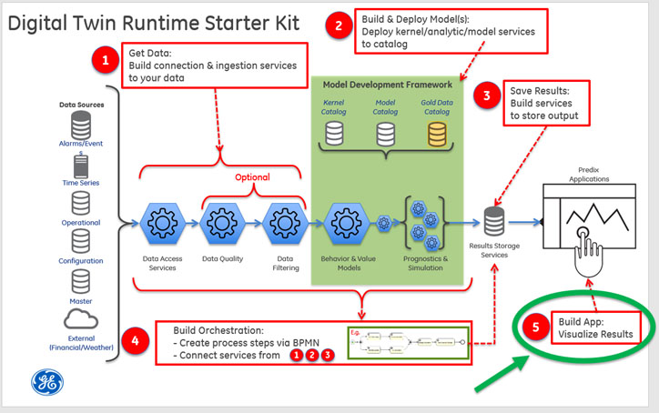
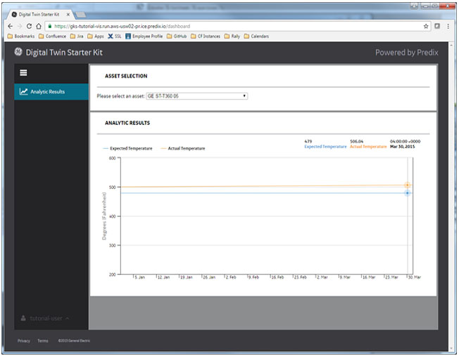

Previous: [Step 4](Step-4.md)

#**Step 5: Build Applications**

##**What you'll learn to do**

Step 5 notes that while every Digital Twin application is likely to have its own visualization requirements, a few common elements are frequently used. In this step, you’ll learn how to set up a simple visualization application that leverages the services and orchestration that we previously built.

Common elements frequently used include:

-   Select asset

-   Tabular view of assets and analytic result status

-   Plot of key analytic results vs time for selected asset

The content for the visual elements are usually provided with the same services used in the workflow. Sometimes these same REST endpoints can be used. Other times, additional REST endpoints are added to provide the information the visualization application requires.

For this tutorial, the visualization application allows the user to select an asset to visualize that asset’s associated data. You can run the simulation from Step 4 to simulate the Digital Twin responding to new data. The simulation will use the sample data created and stored in the time series data service. The Digital Twin workflow will be executed several times, simulating the arrival of new data in the time series (by sending in start and end times to the workflow). The time series data has the sample "actual" data. The analytic will calculate the expected data values based on the model coefficients and also the delta between the expected and the actual values. The expected and actual values will be plotted vs. time.

This fully functional web application pulls data from the "GET" endpoint described here: **Step 3**.  Note that this is not the only URL that this web application uses.

 In this part of the tutorial, you will:

-   Create the **tutorial-vis** application.

-   Explore your data

##**What you need to set up**

You will need a Predix service instance of a [Key-Value (Redis)](https://www.predix.io/services/service.html?id=1215) service and you’ll need to know its name. You’ll also need a properly configured UAA instance. Please refer to the [*Setting up a UAA service in Getting Started*](https://predix-io-dev.grc-apps.svc.ice.ge.com/resources/tutorials/tutorial-details.html?tutorial_id=1915&tag=1913&journey=Digital%20Twin%20Runtime%20Starter%20Kit&resources=1914,1915,1916,1917,1918,1919,1920) to create your own clients, users and secrets for building the tutorial.

##**What you need to do**

###**Create the tutorial-vis application**

**Update URLs to the REST endpoints to get data**

For local testing, edit the steam-turbine-tutorial-vis\\tasks\\options\\connect.js file and put the correct urls in the proxy section for your services.

<table>
<thead>
<tr class="header">
<th><strong>Sample connect.js proxy section</strong></th>
</tr>
</thead>
<tbody>
<tr class="odd">
<td>proxy: { 
    '/api/asset': { 
        url: 'https://<strong>dt-tutorial-asset</strong>.run.aws-usw02-pr.ice.predix.io', 
        instanceId: 'foo', 
        pathRewrite: {'^/api/asset': '/asset'} 
    }, 
    '/api/result': { 
        url: 'https://<strong>dt-tutorial-result-persistence</strong>.run.aws-usw02-pr.ice.predix.io', 
        instanceId: 'foo', 
        pathRewrite: {'^/api/result': '/api/analyticResults'} 
    }, 
    '/ws/result': { 
        url: 'https://<strong>dt-tutorial-result-persistence</strong>.run.aws-usw02-pr.ice.predix.io', 
        instanceId: 'foo', 
        pathRewrite: {'^/ws/result': '/ws'} 
    } 
}</td>
</tr>
</tbody>
</table>

**Update proxy\_pass URLs**

Before pushing your visualization application to Predix, edit the steam-turbine-tutorial-vis\\dist\\nginx.conf file and put the correct urls in the proxy\_pass section of location entries.

<table>
<thead>
<tr class="header">
<th><strong>Sample nginx.conf locations</strong></th>
</tr>
</thead>
<tbody>
<tr class="odd">
<td># Any Api Call made should have bearer token set using set_access_token.lua file 
location /api { 
    access_by_lua_file &lt;%= ENV[&quot;APP_ROOT&quot;] %&gt;/set_access_token.lua; 
    proxy_set_header Authorization $user_token; 
    location /api/asset { 
      proxy_pass https://<strong>dt-tutorial-asset</strong>.run.aws-usw02-pr.ice.predix.io; 
      rewrite /api/asset(.*) /asset$1 break; 
    } 
    location /api/result { 
      proxy_pass https://<strong>dt-tutorial-result-persistence</strong>.run.aws-usw02-pr.ice.predix.io; 
      rewrite /api/result(.*) /api/analyticResults$1 break; 
    } 
} 
location /ws { 
    access_by_lua_file &lt;%= ENV[&quot;APP_ROOT&quot;] %&gt;/set_access_token.lua; 
    proxy_http_version 1.1; 
    proxy_set_header Authorization $user_token; 
    proxy_set_header Connection &quot;upgrade&quot;; 
    proxy_set_header Upgrade $http_upgrade; 
    proxy_read_timeout 120s; 
    location /ws/result { 
      proxy_pass https://<strong>dt-tutorial-result-persistence</strong>.run.aws-usw02-pr.ice.predix.io; 
      rewrite /ws/result(.*) /ws$1 break; 
    } 
}</td>
</tr>
</tbody>
</table>

Also in the nginx.conf file, there is a variable called $client\_id. Its value should be the UAA client id that you wish to handle this authorization. For this tutorial, it should be set to “tutorial-user”. If you set up your UAA service differently than how the Getting Started suggested, then this is the time to ensure that your $client\_id variable here is set correctly.

**Install, Build, and Deploy**

If you are behind a corporate firewall, then you’ll need to configure your proxy in three places:

-   Environment – you’ll need to effectively “set http\_proxy=http://{your-proxy-host}:{your-http-proxy-port}” and “set https\_proxy=http://{your-https-proxy-host}:{your-https-proxy-port}”.

-   Node/npm – you’ll need to:

<pre>
npm config set proxy http://{your-http-proxy-host}:{your-http-proxy-port}
npm config set https-proxy http://{your-https-proxy-host}:{your-https-proxy-port}
</pre>

-   Bower – your .bowerrc file will need to contain these key/value pairs:

<pre>
{
  &quot;proxy&quot;:&quot;http://{your-http-proxy-host}:{your-http-proxy-port}&quot;,
  &quot;https-proxy&quot;:&quot;http://{your-https-proxy-host}:{your-https-proxy-port}&quot;,
}
</pre>

In the top-level directory in the visualization section, run "npm install", "bower install", and "grunt dist" to install dependencies and package the project. 

<pre>
C:\steam-turbine-tutorial-vis&gt;npm install
C:\steam-turbine-tutorial-vis&gt;bower install
C:\steam-turbine-tutorial-vis&gt;grunt dist
</pre>

1)  Configure the appropriate section of the “manifest.yml” file to reflect your environment.

<pre>
---
applications:
- name: &lt;YOUR_OWN_UNIQUE_PREFIX&gt;-tutorial-vis
  host: &lt;YOUR_OWN_VIS_APP_PREFIX&gt;-dt-tutorial-vis
  buildpack: predix_openresty_buildpack
  path: dist
  memory: 64M
  stack: cflinuxfs2
  services:
  - &lt;YOUR_REDIS_SERVICE_NAME&gt;
  env:
    UAA_SERVER_URL: https://&lt;YOUR_UAA_INSTANCE_HERE&gt;.predix-uaa.run.aws-usw02-pr.ice.predix.io
    # UAA_AUTHORIZATION:
    REDIS: redis-&lt;N&gt;
    # SESSION_SECRET:
</pre>

Notes:

-   The application **name** must be unique across your Cloud Foundry organization.

-   The **host** must be unique across Predix as this becomes the URL for the application. If you receive an error message while pushing your application to the cloud in the next step, define a new host.

-   Substitute your Redis service instance name for &lt;YOUR\_REDIS\_SERVICE\_NAME&gt;.

-   Substitute your UAA instance guid for &lt;YOUR\_UAA\_INSTANCE\_HERE&gt;.

-   Substitute the number associated with your Redis service for &lt;N&gt;. You can find this number in the “service” column in the output of “cf services”

<pre>
C:\steam-turbine-tutorial-vis&gt;cf services
Getting services in org 200000000@mail.ad.ge.com / space dev as
200000000@mail.ad.ge.com...
OK
name service plan
…
my-tutorial-redis redis-5 shared-vm
…
</pre>

2)  Push it to Cloud Foundry

<pre>C:\steam-turbine-tutorial-vis&gt;cf push &lt;YOUR_OWN_UNIQUE_PREFIX&gt;-tutorial-vis –no-start</pre>

3)  You’ll need to set two environment variables

- UAA\_AUTHORIZATION - this is a Base64-encoded concatenation of the tutorial-user client’s id, a colon (“:”), and that client’s password. If you used the “create-dt-starter-kit.pl” script in Getting Started, then this string is “tutorial-user:tutorial-user-password”. You can run this string through any trusted Base64 encoding utility to get the &lt;Base64Encoded-clientId:password&gt; needed below.
- SESSION\_SECRET – this can be a string of your choosing as it’ll be used to encrypt data that gets stored in your Redis instance.

<pre>
C:\steam-turbine-tutorial-vis&gt;cf set-env &lt;YOUR_OWN_UNIQUE_PREFIX&gt;-tutorial-vis UAA_AUTHORIZATION &lt;Base64-Encoded-clientId:password&gt;
C:\steam-turbine-tutorial-vis&gt;cf set-env &lt;YOUR_OWN_UNIQUE_PREFIX&gt;-tutorial-vis SESSION_SECRET &lt;your-redis-encryption-string&gt;
</pre>

4)  Start your application.

<pre>C:\steam-turbine-tutorial-vis&gt;cf start &lt;YOUR_OWN_UNIQUE_PREFIX&gt;-tutorial-vis</pre>

5)  Use “cf apps” to discover the URL to your application. Prepend “https://” to this URL, paste it into your browser and authenticate with the “tutorial-user” user account credentials that you set up in Getting Started.

###**Explore your data**

Now that your visualization application is up and running with the support of all the backend services from the previous tutorial steps, you can explore data.

Let’s start with a clean set of data. Using the tutorial-util\\tutorial-timeseries-util from Step 1, repush the /data/ data\_points\_turbine\_1.csv file as steamTurbineId 5. Then use the “Post model coefficients for an asset” request from the Postman collection to create coefficients for assetId 5. Since the steam turbine data is relatively “flat”, feel free to use a slope of zero (or close to zero) and a y-intercept somewhere around 500 (since that’s close to the actual temperature values in the data set).

Now, go back to your browser and change the “select an asset” to the asset named “GE ST-360 05” (the “05” is the asset id in this case). The display will appear to have no data. This is because the simulator needs to be run so that its output is saved to the place where the visualization application will discover it. So, keep your browser open and run the “Simulate workflow” request from Postman (details in Step 4) for assetId 5 from 1420167570000 (1 January 2015) to 1427857170000 (31 March 2015) at an interval of 21600000 milliseconds (6 hours). In a few seconds, you should see your browser start to dynamically update the display showing a plot of the actual temperatures (from the time series data) and expected temperatures (calculated by the analytic given the asset’s coefficients) versus time. As time progresses, you’ll see the actual temperature drifting higher gradually pulling away from the calculated expected temperature (for a model slope coefficient set to zero). To a steam turbine engineer, this delta would indicate that the sensors are drifting, the model coefficients are wrong and need to be tuned, or that there is a legitimate problem with the asset and that maintenance should be scheduled.

##**What you learned**

You learned how to configure connect.js and nginx.conf prior to building your application using node, npm, and grunt. You learned how to work with a corporate proxy. You then learned how to configure your manifest.yml file and push your visualization application to Cloud Foundry. Finally, you learned how to explore your data using the visualization application.

Next: [Creating Your Own Digital Twin](Creating Your Own Digital Twin.md)
